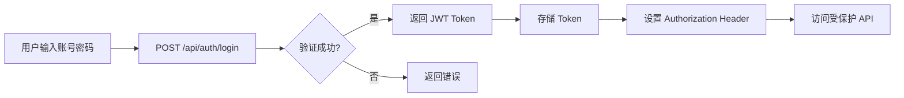

# AI 辅助代码学习平台 - 桌面端 UI 设计方案

## 🎨 设计理念

基于 VS Code Dark+ 风格的现代化桌面应用界面设计。

---

##  布局结构

### 主布局 (AppLayout)

```
┌─────────────────────────────────────────────┐
│  侧边栏 (Sidebar)  │  主内容区 (Main)      │
│                    │                       │
│  • 导航菜单        │  • 路由内容            │
│  • 用户信息        │  • 页面组件            │
│  • 设置入口        │                       │
└─────────────────────────────────────────────┘
```

### 页面结构

1. **登录页面** (`/login`)
   - 居中的登录表单
   - 品牌标识
   - 注册入口

2. **仪表板** (`/dashboard`)
   - 学习进度概览
   - 最近课程
   - 统计数据

3. **课程列表** (`/lessons`)
   - 课程卡片网格
   - 搜索和筛选
   - 难度标签

4. **课程详情** (`/lessons/:id`)
   - 课程内容
   - 代码编辑器
   - 练习题目

5. **AI 助手** (`/chat`)
   - 聊天界面
   - 消息历史
   - 代码高亮

6. **用户设置** (`/settings`)
   - 个人信息
   - 偏好设置
   - 主题切换

---

## 🎨 配色方案

### VS Code Dark+ 主题

```css
/* 主要颜色 */
--bg-primary: #1e1e1e        /* 主背景 */
--bg-secondary: #252526      /* 次背景 */
--bg-tertiary: #333333       /* 第三背景 */
--bg-hover: #2a2d2e          /* 悬停背景 */

/* 文字颜色 */
--text-primary: #cccccc      /* 主文字 */
--text-secondary: #858585    /* 次文字 */
--text-muted: #6a6a6a        /* 弱化文字 */

/* 强调色 */
--accent-blue: #007acc       /* 主强调色 */
--accent-blue-hover: #1a8ad4 /* 悬停强调色 */

/* 边框 */
--border-color: #454545      /* 边框颜色 */

/* 状态色 */
--success: #4ec9b0           /* 成功 */
--warning: #dcdcaa           /* 警告 */
--error: #f44747             /* 错误 */
--info: #569cd6              /* 信息 */
```

---

## 📦 组件设计

### 1. 侧边栏组件 (Sidebar)

```tsx
import { Home, BookOpen, MessageSquare, Settings, User } from "lucide-react"

const menuItems = [
  { icon: Home, label: "仪表板", path: "/dashboard" },
  { icon: BookOpen, label: "课程", path: "/lessons" },
  { icon: MessageSquare, label: "AI 助手", path: "/chat" },
  { icon: User, label: "个人", path: "/profile" },
  { icon: Settings, label: "设置", path: "/settings" },
]
```

### 2. 导航栏 (Navbar)

```tsx
import { Bell, Search, Moon, Sun } from "lucide-react"

// 功能：
// - 搜索框
// - 通知图标
// - 主题切换
// - 用户头像
```

### 3. 卡片组件 (Cards)

```tsx
// 课程卡片
<Card>
  <CardHeader>
    <CardTitle>Go 语言基础</CardTitle>
    <Badge>初级</Badge>
  </CardHeader>
  <CardContent>
    <Progress value={65} />
    <p className="text-sm text-muted-foreground">进度: 65%</p>
  </CardContent>
  <CardFooter>
    <Button>继续学习</Button>
  </CardFooter>
</Card>
```

### 4. 代码编辑器 (CodeEditor)

```tsx
import { Editor } from "@monaco-editor/react"

// 功能：
// - 语法高亮
// - 代码补全
// - 错误提示
// - 运行代码
```

---

## 🔌 API 集成

### API 服务层

```typescript
// src/services/api.ts
import axios from 'axios'

const api = axios.create({
  baseURL: 'http://localhost:8080/api',
  timeout: 10000,
})

// 请求拦截器
api.interceptors.request.use((config) => {
  const token = localStorage.getItem('token')
  if (token) {
    config.headers.Authorization = `Bearer ${token}`
  }
  return config
})

// 响应拦截器
api.interceptors.response.use(
  (response) => response,
  (error) => {
    if (error.response?.status === 401) {
      // 跳转到登录页
      window.location.href = '/login'
    }
    return Promise.reject(error)
  }
)

export default api
```

### API 端点

```typescript
// src/services/auth.ts
export const authAPI = {
  login: (data: LoginRequest) => api.post('/auth/login', data),
  register: (data: RegisterRequest) => api.post('/auth/register', data),
  getProfile: () => api.get('/auth/profile'),
}

// src/services/lessons.ts
export const lessonsAPI = {
  getList: () => api.get('/lessons'),
  getDetail: (id: string) => api.get(`/lessons/${id}`),
  complete: (id: string) => api.post(`/lessons/${id}/complete`),
}

// src/services/chat.ts
export const chatAPI = {
  sendMessage: (message: string) => api.post('/chat', { message }),
}
```

---

##  路由设计

```typescript
// src/routes/index.tsx
import { BrowserRouter, Routes, Route } from "react-router-dom"
import AppLayout from "@/components/layout/AppLayout"
import Login from "@/pages/Login"
import Dashboard from "@/pages/Dashboard"
import Lessons from "@/pages/Lessons"
import LessonDetail from "@/pages/LessonDetail"
import Chat from "@/pages/Chat"
import Settings from "@/pages/Settings"
import ProtectedRoute from "@/components/auth/ProtectedRoute"

function AppRoutes() {
  return (
    <BrowserRouter>
      <Routes>
        <Route path="/login" element={<Login />} />
        <Route path="/" element={<ProtectedRoute><AppLayout /></ProtectedRoute>}>
          <Route index element={<Dashboard />} />
          <Route path="lessons" element={<Lessons />} />
          <Route path="lessons/:id" element={<LessonDetail />} />
          <Route path="chat" element={<Chat />} />
          <Route path="settings" element={<Settings />} />
        </Route>
      </Routes>
    </BrowserRouter>
  )
}
```

---

## 🗄️ 后端 API 设计

### 现有 API 端点

| 方法 | 路径 | 描述 | 认证 |
|------|------|------|------|
| POST | `/api/auth/register` | 用户注册 | ❌ |
| POST | `/api/auth/login` | 用户登录 | ❌ |
| GET | `/api/auth/profile` | 获取用户信息 | ✅ |
| GET | `/api/lessons` | 获取课程列表 | ✅ |
| GET | `/api/lessons/:id` | 获取课程详情 | ✅ |
| POST | `/api/lessons/:id/complete` | 完成课程 | ✅ |
| POST | `/api/chat` | AI 对话 | ✅ |

### API 响应格式

```json
// 成功响应
{
  "code": 200,
  "message": "success",
  "data": { ... }
}

// 错误响应
{
  "code": 400,
  "message": "error message",
  "error": "details"
}
```

---

##  认证流程



---

## 📊 数据流

```
用户操作
  ↓
React 组件
  ↓
API Service
  ↓
Axios 请求
  ↓
Gin 后端
  ↓
数据库
  ↓
响应数据
  ↓
更新 UI
```

---

##  实现步骤

### Phase 1: 基础架构 (已完成 ✅)
- [x] Radix UI + Tailwind CSS 配置
- [x] 基础 UI 组件 (Button, Card, Input)
- [x] 路径别名配置
- [x] 开发环境搭建

### Phase 2: 页面开发 (进行中 🔄)
- [ ] 布局组件 (AppLayout, Sidebar, Navbar)
- [ ] 登录页面
- [ ] 仪表板页面
- [ ] 课程列表页面
- [ ] 课程详情页面
- [ ] AI 聊天页面
- [ ] 设置页面

### Phase 3: API 集成 (待开始 ⏳)
- [ ] Axios 配置
- [ ] API 服务层
- [ ] 认证拦截器
- [ ] 错误处理
- [ ] 数据缓存

### Phase 4: 功能完善 (待开始 ⏳)
- [ ] 代码编辑器集成
- [ ] 主题切换
- [ ] 响应式设计
- [ ] 性能优化
- [ ] 单元测试

---

## ️ 技术栈

### 前端
- **框架**: React 18 + TypeScript
- **UI**: Radix UI + Tailwind CSS
- **路由**: React Router v6
- **HTTP**: Axios
- **图标**: Lucide React
- **代码编辑器**: Monaco Editor (可选)

### 后端
- **框架**: Gin (Go)
- **数据库**: SQLite
- **认证**: JWT
- **AI**: OpenAI API

### 桌面端
- **框架**: Wails v2
- **打包**: Inno Setup (Windows) / DMG (macOS)

---

## 📁 目录结构

```
web/wails-app/frontend/
├── src/
│   ├── components/
│   │   ├── layout/              ← 布局组件
│   │   │   ├── AppLayout.tsx
│   │   │   ├── Sidebar.tsx
│   │   │   └── Navbar.tsx
│   │   ├── ui/                  ← UI 组件
│   │   │   ├── button.tsx
│   │   │   ├── card.tsx
│   │   │   ├── input.tsx
│   │   │   ├── badge.tsx
│   │   │   └── progress.tsx
│   │   └── auth/                ← 认证组件
│   │       ── ProtectedRoute.tsx
│   ├── pages/                   ← 页面组件
│   │   ├── Login.tsx
│   │   ├── Dashboard.tsx
│   │   ├── Lessons.tsx
│   │   ├── LessonDetail.tsx
│   │   ├── Chat.tsx
│   │   └── Settings.tsx
│   ├── services/                ← API 服务
│   │   ├── api.ts
│   │   ├── auth.ts
│   │   ├── lessons.ts
│   │   └── chat.ts
│   ├── hooks/                   ← 自定义 Hooks
│   │   ├── useAuth.ts
│   │   └── useLessons.ts
│   ├── store/                   ← 状态管理
│   │   └── auth.ts
│   ├── lib/
│   │   └── utils.ts
│   ├── styles/
│   │   └── globals.css
│   └── App.tsx
└── docs/
    └── UI_DESIGN_PLAN.md        ← 本文档
```

---

##  开始实现

现在我将开始实现这些组件和页面。请告诉我：

1. **优先级**: 你最想先实现哪个页面？
   - 登录页面
   - 仪表板
   - 课程列表
   - AI 聊天

2. **功能重点**: 哪些功能是最重要的？
   - 用户认证
   - 课程学习
   - AI 对话
   - 代码编辑

3. **样式偏好**: 
   - 继续使用 VS Code Dark+ 主题？
   - 还是需要其他配色方案？

我会根据你的需求逐步实现完整的桌面端 UI！
